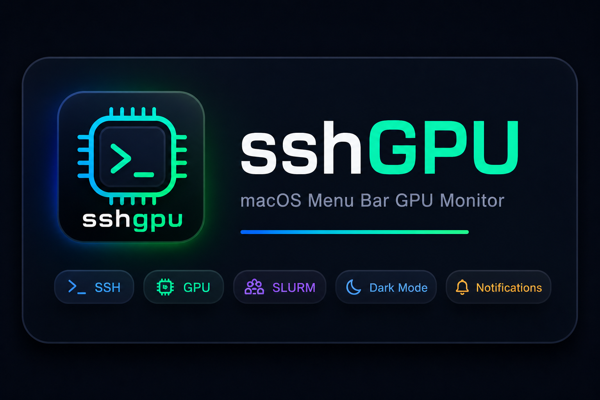

<p align="center">
  
</p>

<p align="center">
  <strong>macOS 菜单栏远程 GPU 服务器监控工具</strong>
</p>

<p align="center">
  <a href="#功能特性">功能特性</a> •
  <a href="#安装">安装</a> •
  <a href="#使用方法">使用方法</a> •
  <a href="#配置">配置</a> •
  <a href="#开发">开发</a> •
  <a href="#贡献">贡献</a> •
  <a href="README.md">English</a>
</p>

<p align="center">
  
  
  
  
  
</p>

---

## 功能特性

- **GPU 监控** — 每块 GPU 的利用率、显存、温度、进程列表
- **三种视觉状态** — 活跃、空闲（显存占用）、可用（显存已释放）
- **利用率历史** — SVG 迷你图展示最近 60 次轮询周期
- **任务监控** — SLURM `squeue` 和 `ps aux`，支持运行/历史标签切换
- **通知提醒** — macOS 原生通知 + 钉钉群机器人 Webhook
- **深色模式** — 自动跟随系统偏好 + 手动切换
- **自动发现** — 从 `~/.ssh/config` 自动发现服务器，支持手动添加
- **数据导出** — 将 GPU 数据和任务历史导出为 JSON 或 CSV

## 安装

### 下载安装

从 [Releases](../../releases) 下载最新的 `.dmg` 文件，将 SSHGPU 拖入 Applications 文件夹。

> **注意：** 由于应用未签名，首次启动会被 macOS 阻止。请前往 **系统设置 → 隐私与安全性**，点击 **仍要打开**。

### 从源码构建

前置条件：
- macOS 系统
- [Node.js](https://nodejs.org/) >= 18（自带 npm）
- 已配置基于密钥的 SSH 认证访问远程服务器

```bash
git clone https://github.com/zhouzhengqd/sshgpu.git
cd sshgpu
npm install
npm run package
```

输出文件：`release/SSHGPU-{version}.dmg`

## 远程服务器要求

被监控的服务器需要：
- 在 `~/.ssh/config` 中配置基于密钥的 SSH 认证
- 安装 `nvidia-smi`（GPU 监控）
- 安装 `squeue`（SLURM，可选 — 无则回退到 `ps aux`）
- 安装 `conda`（可选 — 用于列出环境）

## 使用方法

1. 启动 SSHGPU — 它会出现在 macOS 菜单栏
2. 点击托盘图标打开弹出窗口
3. `~/.ssh/config` 中的服务器会被自动发现并测试连接
4. 通过设置（齿轮图标）手动添加服务器

### GPU 状态

| 状态 | 条件 | 视觉效果 |
|------|------|----------|
| **可用** | 利用率 < 阈值 且 显存 < 10% | 绿色边框 |
| **空闲** | 利用率 < 阈值，显存仍被占用 | 橙色边框 |
| **活跃** | 利用率 >= 阈值 | 默认边框 |

### 托盘图标

菜单栏显示：`2/3 | 4 idle | 2 avail`

- `2/3` — 3 台服务器中有 2 台在线
- `4 idle` — 4 块 GPU 低于利用率阈值
- `2 avail` — 2 块 GPU 真正可用（低显存）

## 配置

设置存储在 `~/Library/Application Support/sshgpu/config.json`：

| 设置 | 默认值 | 说明 |
|------|--------|------|
| `pollingInterval` | 120 | 数据刷新间隔（秒） |
| `idleThreshold` | 30 | GPU 空闲判定时间（分钟） |
| `idleUtilizationThreshold` | 5 | GPU 利用率低于此值视为空闲 |
| `notificationEnabled` | true | 启用 macOS 通知 |
| `quietHoursStart` | "22:00" | 免打扰开始时间 |
| `quietHoursEnd` | "08:00" | 免打扰结束时间 |
| `terminalApp` | "Terminal.app" | SSH 终端（Terminal.app 或 iTerm2） |
| `theme` | "system" | 界面主题：system/light/dark |
| `dingtalkWebhook` | "" | 钉钉 Webhook URL（留空则不启用） |

## 开发

```bash
# 克隆并安装
git clone https://github.com/zhouzhengqd/sshgpu.git
cd sshgpu
npm install

# 开发模式（热更新）
npm run dev

# 运行测试（34 个测试用例）
npm test

# 生产构建
npm run build

# 打包为 .dmg（自动先执行构建）
npm run package
```

### 架构

```
src/
  main/                    # Electron 主进程
    index.ts               # 应用入口，事件绑定
    collector.ts           # SSH 数据采集
    store.ts               # 内存数据存储
    history-store.ts       # 持久化任务历史
    utilization-history.ts # 利用率环形缓冲区（60 个点）
    notifier.ts            # 空闲 GPU 通知
    dingtalk.ts            # 钉钉 Webhook
    export.ts              # JSON/CSV 导出
    ipc.ts                 # IPC 处理器
    preload.ts             # contextBridge API
    ssh/
      config-parser.ts     # ~/.ssh/config 解析器
      connection-manager.ts# 通过系统 ssh 命令连接
      output-parser.ts     # nvidia-smi、squeue、ps aux 解析器
  renderer/                # React + TypeScript + Vite
    components/            # UI 组件
    hooks/useServers.ts    # 轮询 Hook（3 秒间隔）
    styles/global.css      # CSS 变量，深色模式
  shared/types.ts          # TypeScript 接口定义
```

### 关键设计决策

- **使用系统 `ssh` 命令**而非 ssh2 库 — 利用用户现有的 SSH 密钥/代理，无需管理凭据
- **轮询**而非推送 — 在 Electron contextIsolation 下更简单
- **基于 PID 的任务历史** — 监控 `ps aux`，当 PID 消失时记录历史
- **`spawn('ssh', args)`** — 无 shell 解释，防止命令注入

## 测试

```bash
npm test              # 运行所有测试
npm run test:watch    # 监听模式
```

## 贡献

欢迎贡献！请随时提交 Pull Request。

1. Fork 本仓库
2. 创建功能分支 (`git checkout -b feature/amazing-feature`)
3. 运行测试 (`npm test`)
4. 提交更改 (`git commit -m 'Add amazing feature'`)
5. 推送到分支 (`git push origin feature/amazing-feature`)
6. 提交 Pull Request

## 许可证

MIT

## 致谢

本项目在 [MIMO](https://100t.xiaomimimo.com/) 百亿 Token 补贴计划的支持下完成，该计划提供了 AI 编程辅助，帮助 SSHGPU 从概念走向实现。

> 邀请码：`NNRLFS` — 可领取 10 元免费额度

感谢所有贡献者和开源社区。
